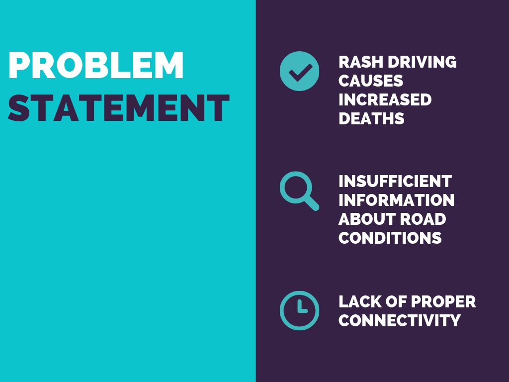
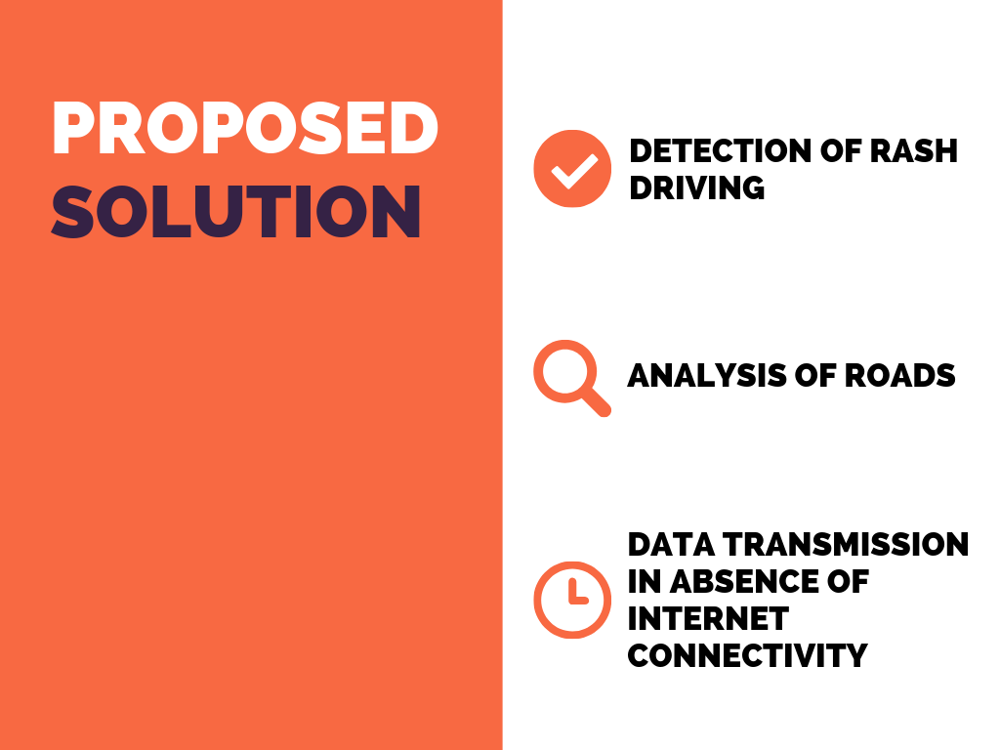
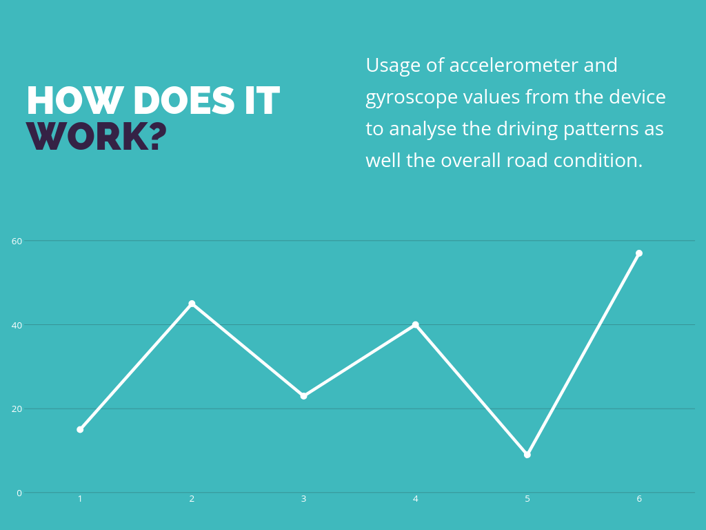
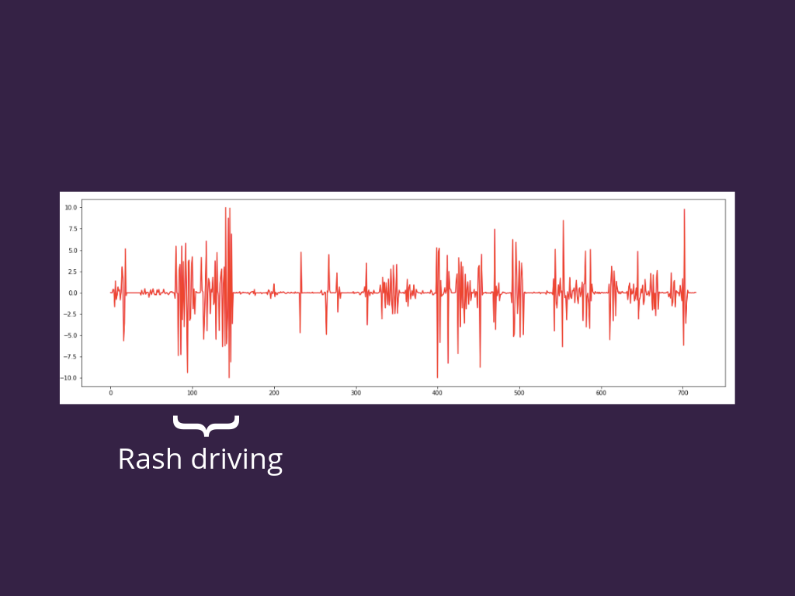
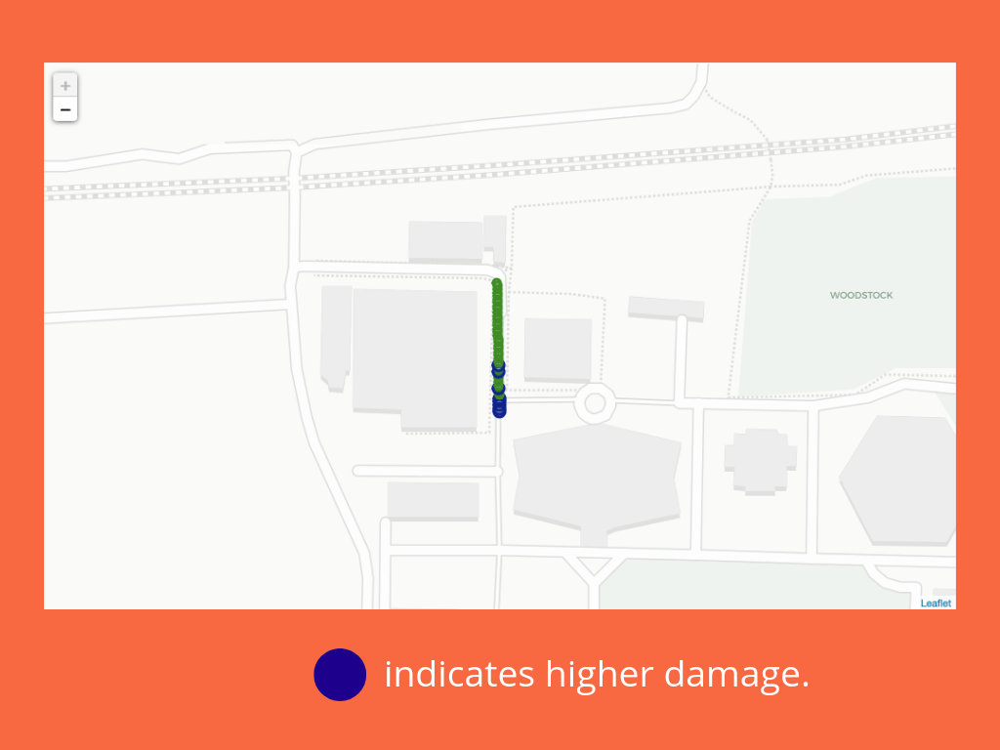

# accelMetric

</img>

This applications allows drivers to analyse their driving to detect rash driving as well as understand the road conditions.

## Demonstration

</img>

## About the project

</img>

</img>

</img>

</img>

</img>

</img>

</img>

</img>

## Timeline
This was developed during Arcs'19 organised by the IEEE Computer Society, VIT Vellore.
